<!-- Banner GIF Background -->
<p align="center">
  
</p>

<div align="center">
  
</div>

<h1 align="center">Hi, I'm Y Phai Niê 👋</h1>
<h3 align="center">🚀 Final-year AI Student | Aspiring Full-stack Developer | Based in Vietnam 🇻🇳</h3>

<p align="center">
  
</p>

---

## 🎓 Education & Career Timeline

```mermaid
timeline
    title My Journey 🚀
    
    2020 : Started University
         : 📚 Computer Science Major
         : 🎯 Focus on Programming Fundamentals
    
    2021 : Web Development Journey
         : 🌐 Learned HTML, CSS, JavaScript
         : ⚛️ Started with React
         : 🎨 UI/UX Design Interest
    
    2022 : Backend & Database
         : ☕ Java & Spring Boot
         : 🗄️ MySQL & MongoDB
         : 🐳 Docker & DevOps
    
    2023 : AI & Machine Learning
         : 🤖 Python for AI/ML
         : 📊 Data Science Projects
         : 🧠 Deep Learning Exploration
    
    2024 : Full-Stack Projects
         : 🚀 Complete Web Applications
         : 📱 Mobile Development (Flutter)
         : 🔧 System Design & Architecture
    
    2025 : Final Year & Beyond
         : 🎓 Graduation Preparation
         : 💼 Job Search & Internships
         : 🌟 Open Source Contributions
```

<div align="center">



</div>

---

## 🌐 Socials:

[](https://www.instagram.com/youngestwall/)
[](https://www.linkedin.com/in/youngestwall/)
[](https://www.reddit.com/user/youngestwall/)
[](https://www.tiktok.com/@youngestwall)
[](https://www.twitch.tv/youngestwall)
[](https://x.com/youngestwall)
[](https://www.youtube.com/@youngestwall)
[](mailto:phainie03@gmail.com)

---

## 🌟 Portfolio Website

<div align="center">
  <a href="https://youngestwall.github.io" target="_blank">
    
  </a>
</div>

<p align="center">
  
  
  
</p>

### 🎨 What you'll find in my portfolio:
- 💼 **Professional Projects** - Showcase of my best work
- 🛠️ **Technical Skills** - Detailed breakdown of technologies I use
- 📝 **Blog Posts** - My thoughts on tech and development
- 📞 **Contact Form** - Get in touch directly
- 📄 **Resume Download** - Latest CV in PDF format

<div align="center">
  
</div>

---

## 📌 Featured Projects

### 🏆 Project Showcase

<div align="center">

| Project | Description | Tech Stack | Features |
|---------|-------------|------------|----------|
| 👗 **Fashion Shop** | Modern e-commerce platform for fashion retail | React, Node.js, MongoDB, Express | 🛒 Shopping Cart, � Product Catalog, � Search & Filter |
| 🍔 **Food Delivery App** | Mobile application for food ordering and delivery | React Native, Firebase, Node.js | � Cross-platform, � Real-time Tracking, 💳 Payment Gateway |
| 🎯 **Web Portfolio** | Personal portfolio website showcasing projects | HTML, CSS, JavaScript, Bootstrap | 📱 Responsive Design, ⚡ Fast Loading, 🎨 Modern UI |
| 🤖 **AI Projects** | Collection of AI/ML experiments and demos | Python, TensorFlow, Jupyter | 🧠 Machine Learning, � Data Analysis, � Research Projects |

</div>

### 🚀 Live Project Demos

<p align="center">
  <a href="https://github.com/youngestwall/shop_fashion">
    
  </a>
  <a href="https://github.com/youngestwall/mobile_app_food_delivery">
    
  </a>
</p>

### 💡 Project Highlights

<details>
<summary><b>👗 Fashion Shop E-Commerce</b> - Click to expand</summary>

**🎯 Overview:**
A modern, responsive e-commerce platform specifically designed for fashion retail, featuring a clean UI and seamless shopping experience.

**✨ Key Features:**
- 🛒 **Smart Shopping Cart** - Add to cart, quantity management, wishlist
- � **Product Catalog** - Browse by categories, brands, sizes, colors
- � **Advanced Search & Filter** - Find products by price, rating, popularity
- 📱 **Mobile Responsive** - Optimized for all devices and screen sizes
- � **User Authentication** - Secure login/register system
- ⭐ **Reviews & Ratings** - Customer feedback and product ratings

**🛠️ Technologies Used:**
- **Frontend:** React.js, CSS3, JavaScript ES6+
- **Backend:** Node.js, Express.js
- **Database:** MongoDB, Mongoose
- **Authentication:** JWT, bcryptjs
- **Styling:** CSS Modules, Responsive Design

**🔗 Links:**
- [📖 GitHub Repository](https://github.com/youngestwall/shop_fashion)
- [🌐 Live Demo](https://youngestwall.github.io/shop_fashion) *(if deployed)*
- [� Screenshots](https://github.com/youngestwall/shop_fashion#screenshots)

**📊 Project Stats:**
- ⭐ Stars: 
- � Forks: 
- 📠Commits: 

</details>

<details>
<summary><b>🍔 Food Delivery Mobile App</b> - Click to expand</summary>

**🎯 Overview:**
A comprehensive mobile application for food ordering and delivery, providing users with a seamless experience from browsing restaurants to tracking orders.

**✨ Key Features:**
- 📱 **Cross-platform Mobile App** - Works on both iOS and Android
- 🍕 **Restaurant Discovery** - Browse local restaurants and cuisines
- � **Real-time Order Tracking** - Live updates on delivery status
- 💳 **Multiple Payment Options** - Credit cards, digital wallets, cash
- ⭐ **Restaurant Reviews** - User ratings and feedback system
- 🔔 **Push Notifications** - Order updates and promotional offers

**🛠️ Technologies Used:**
- **Mobile:** React Native, Expo
- **Backend:** Node.js, Express.js, Socket.io
- **Database:** Firebase Firestore, Real-time Database
- **Authentication:** Firebase Auth
- **Maps:** Google Maps API, Geolocation
- **Payments:** Stripe API integration

**🔗 Links:**
- [📖 GitHub Repository](https://github.com/youngestwall/mobile_app_food_delivery)
- [📱 APK Download](https://github.com/youngestwall/mobile_app_food_delivery/releases) *(if available)*
- [🎥 Demo Video](https://github.com/youngestwall/mobile_app_food_delivery#demo) *(if available)*

**📊 Project Stats:**
- ⭐ Stars: 
- 🴠Forks: 
- � Language: 

</details>

<details>
<summary><b>🌐 Portfolio Website</b> - Click to expand</summary>

**🎯 Overview:**
My personal portfolio website showcasing my projects, skills, and professional journey as a developer.

**✨ Key Features:**
- 🎨 **Modern Design** - Clean, professional, and visually appealing
- � **Fully Responsive** - Works perfectly on all devices
- ⚡ **Fast Loading** - Optimized performance and SEO
- � **Dark/Light Mode** - Theme switching capability
- � **Contact Form** - Direct communication channel
- � **Resume Download** - Latest CV in PDF format

**🛠️ Technologies Used:**
- **Frontend:** HTML5, CSS3, JavaScript
- **Framework:** Bootstrap, jQuery
- **Hosting:** GitHub Pages
- **Tools:** Git, VS Code

**🔗 Links:**
- [🌐 Live Website](https://youngestwall.github.io)
- [📖 Source Code](https://github.com/youngestwall/youngestwall.github.io)

</details>

<details>
<summary><b>🤖 AI & Machine Learning Projects</b> - Click to expand</summary>

**🎯 Overview:**
A collection of AI and Machine Learning projects showcasing my exploration in artificial intelligence, data science, and deep learning.

**✨ Project Categories:**
- 🧠 **Machine Learning Models** - Classification, regression, clustering
- � **Data Analysis** - Statistical analysis and visualization
- � **Research Projects** - Academic and experimental work
- 🤖 **AI Applications** - Practical AI implementations
- � **Predictive Analytics** - Forecasting and trend analysis

**🛠️ Technologies Used:**
- **Languages:** Python, R, SQL
- **Libraries:** TensorFlow, PyTorch, Scikit-learn, Pandas, NumPy
- **Tools:** Jupyter Notebook, Google Colab, Anaconda
- **Visualization:** Matplotlib, Seaborn, Plotly

**🔗 Links:**
- [📚 AI Projects Collection](https://github.com/youngestwall?tab=repositories&q=AI)
- [� Kaggle Profile](https://kaggle.com/youngestwall) *(if available)*
- [� Research Papers](https://github.com/youngestwall/research-papers) *(if available)*

</details>

<!-- Cập nhật với repository thực tế của Y Phai Niê -->

---

## 💻 Tech Stack:


---

## 📊 GitHub Stats

<p align="center">
  
</p>

<p align="center">
  
</p>

<p align="center">
  
</p>

---

## 🏆 GitHub Trophies

<p align="center">
  
</p>

---

## 🎮 Fun Zone

<div align="center">
  
### 🐍 Play Snake Game (Click the snake!)
[](https://github.com/youngestwall/youngestwall/blob/output/github-contribution-grid-snake.svg)

### 🎯 Current Goals & Achievements
  
```text
🚀 2025 Goals Progress:

▓▓▓▓▓▓▓▓▓▓ 100%  Master React & Advanced JavaScript
▓▓▓▓▓▓▓▓░░  80%   Spring Boot & Microservices
▓▓▓▓▓▓░░░░  60%   AI/ML with Python & TensorFlow
▓▓▓▓▓░░░░░  50%   DevOps & Cloud Technologies
▓▓▓░░░░░░░  30%   System Design & Architecture
▓▓░░░░░░░░  20%   Open Source Contributions

🏆 Recent Achievements:
✅ Completed 50+ coding challenges
✅ Built 4 full-stack applications
✅ Contributed to 3 open source projects
✅ Learned Docker & Kubernetes
✅ Deployed apps on AWS & GCP
```

### 🎨 GitHub Activity Art


</div>

---

## ✍️ Dev Quote of the Day

<p align="center">
  
</p>

---

<p align="center">
  
</p>

<!-- Proudly crafted with love by Y Phai Niê 🛠️ -->
